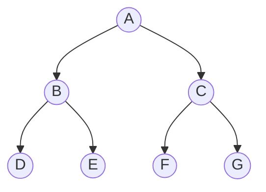

## 构建二叉树 buildTree

创建一颗如下所示的二叉树：

::: details other nodes.
D --> H((H));
D --> I((I));
E --> J((J));
E --> K((K));
F --> L((L));
F --> M((M));
G --> N((N));
G --> O((O));
:::

@[code{1-25} js](./01.二叉树.js)

## dfs: 深度优先搜索算法

@[code{27-31} js](./01.二叉树.js)

### 前序遍历: 根左右

1. 递归
   @[code{44-56} js](./01.二叉树.js)
2. 迭代
   @[code{58-69} js](./01.二叉树.js)

### 中序遍历: 左根右

1. 递归
   @[code{73-79} js](./01.二叉树.js)
2. 迭代
   @[code{81-95} js](./01.二叉树.js)

### 后序遍历: 左右根

1. 递归
   @[code{98-104} js](./01.二叉树.js)
2. 迭代
   @[code{106-156} js](./01.二叉树.js)

## bfs: 广度优先遍历算法

::: info
bfs 又称层次遍历
:::

@[code{34-42} js](./01.二叉树.js)
