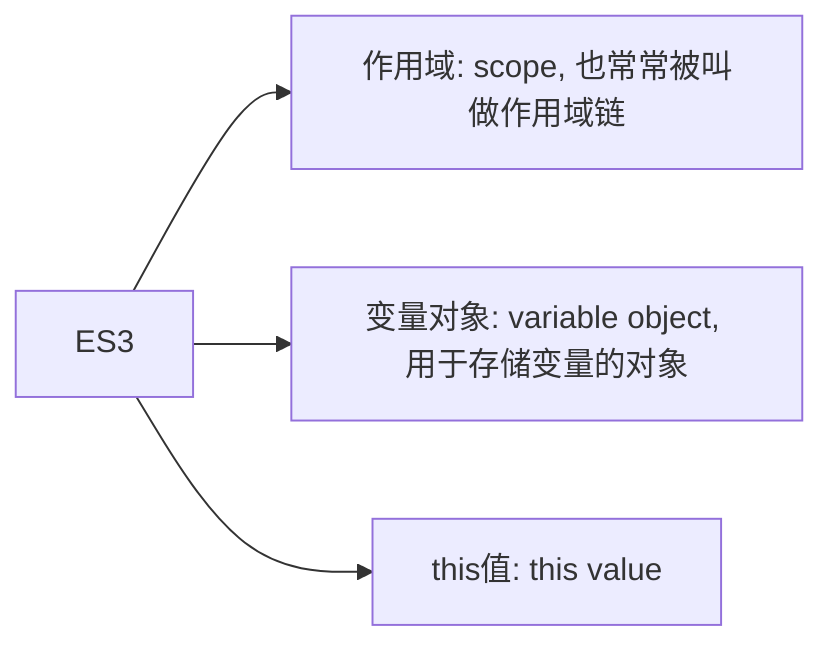
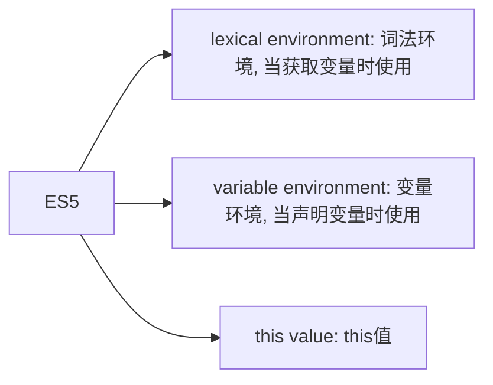
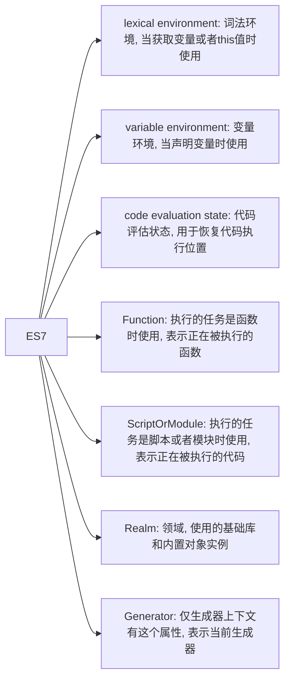

## ES3

执行上下文在 ES3 中:

```mermaid
graph LR
    A[ES3] --> B[作用域: scope, 也常常被叫做作用域链];
    A --> C[变量对象: variable object, 用于存储变量的对象];
    A --> D[this值: this value];
```

## ES5 (ES2016)

在 ES5 中，我们改进了命名方式，把执行上下文最初的三个部分改为:

```mermaid
graph LR
  A[ES5] --> B[lexical environment: 词法环境, 当获取变量时使用];
  A --> C[variable environment: 变量环境, 当声明变量时使用];
  A --> D[this value: this值];
```

## ES7 (ES2018)

```mermaid
graph LR
  A[ES7] --> B[lexical environment: 词法环境, 当获取变量或者this值时使用];
  A --> C[variable environment: 变量环境, 当声明变量时使用];
  A --> D[code evaluation state: 代码评估状态, 用于恢复代码执行位置];
  A --> E[Function: 执行的任务是函数时使用, 表示正在被执行的函数];
  A --> F[ScriptOrModule: 执行的任务是脚本或者模块时使用, 表示正在被执行的代码];
  A --> G[Realm: 领域, 使用的基础库和内置对象实例];
  A --> H[Generator: 仅生成器上下文有这个属性, 表示当前生成器];
```
