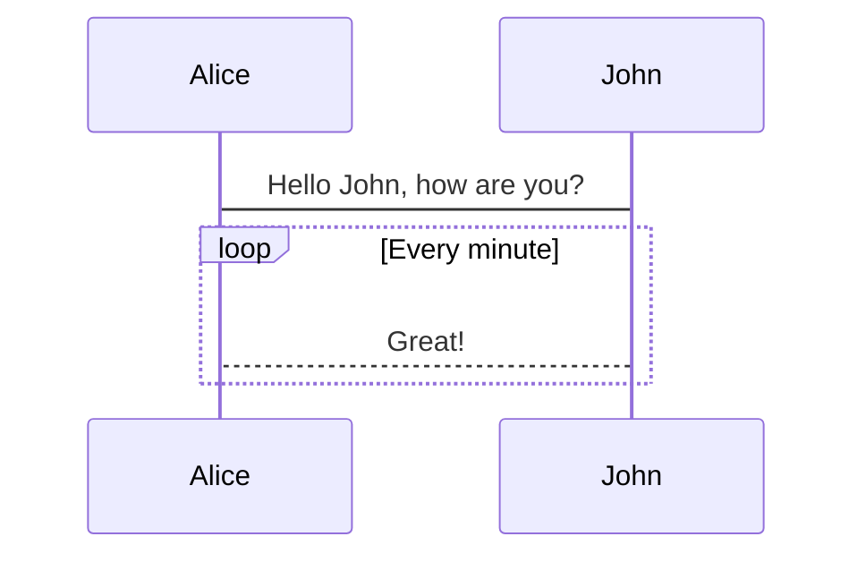

## 数学公式 LaTeX

行内公式：$E = mc^2$

行块公式：

$$
i\hbar\frac{\partial \psi}{\partial t} = \frac{-\hbar^2}{2m} ( \frac{\partial^2}{\partial x^2} + \frac{\partial^2}{\partial y^2} + \frac{\partial^2}{\partial z^2} ) \psi + V \psi.
$$

## 图表库 Chart.js

```chart
{
  "type": "doughnut",
  "data": {
    "datasets": [{
      "data": [10, 20, 30],
      "backgroundColor": [
        "rgba(255, 99, 132)",
        "rgba(255, 206, 86)",
        "rgba(54, 162, 235)"
      ]
    }],
    "labels": ["Red", "Yellow", "Blue"]
  }
}
```

## Mermaid

通过插件 [plugin-mermaid](https://v2-vuepress-theme-gungnir.vercel.app/zh/docs/plugins/mermaid.html#%E9%85%8D%E7%BD%AE%E9%A1%B9) 来在 Markdown 中使用 [Mermaid](https://mermaid-js.github.io/mermaid/#/)，从而在文章中加入流程图、状态图、时序图、甘特图等：



更详细的用法可以参考 [Mermaid 文档](https://mermaid-js.github.io/)。

## md plus

::: tips
当前支持: 脚注;高亮标记;下标;上标;
:::

### 1. footnote

给文字加上脚注[^1]

[^1]: 脚注内容

### 2. mark

衬衫的价格是 ==九磅十五便士==

### 3. sub

H~2~O

### 4. sup

29^th^
